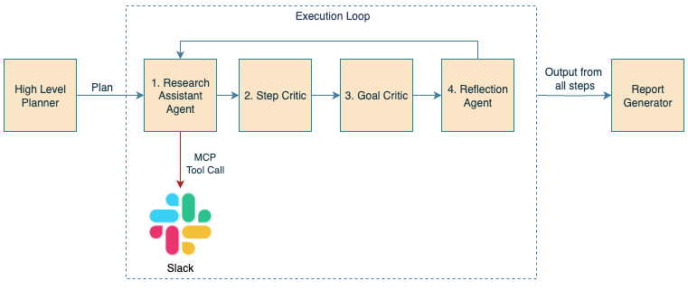
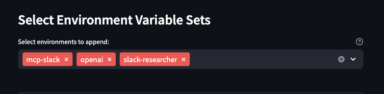

# Slack Researcher Agent

## Introduction

The Slack Researcher Agent is designed to perform research tasks across Slack channels, leveraging large language models (LLMs) to generate plans, execute steps, and summarize findings. This agent integrates with Slack as a tool via MCP and utilizes AI models for data extraction, summarization, and more. The architecture enables iterative task decomposition, allowing the agent to handle complex tasks by breaking them down into smaller steps.

## Architecture

### Configuration Variables

| Variable Name | Description | Required? | Default Value | 
|---------------|-------------|-----------|---------------| 
| LLM_API_BASE | The URL for OpenAI compatible API | Yes | `http://localhost:11434/v1` | 
| LLM_API_KEY | The API key for OpenAI compatible API | No |  `my_api_key` |
| TASK_MODEL_ID | The ID of the LLM | Yes | `granite3.3:8b` | 
| EXTRA_HEADERS | Extra headers for the OpenAI API, e.g. {"MY_HEADER": "my_value"} | No | `{}` | 
| MODEL_TEMPERATURE | The temperature for the model | Yes | `0` | 
| MAX_PLAN_STEPS | The maximum number of plan steps | Yes | `6` | 
| MCP_URL | Endpoint where the Slack MCP server can be found | No |  "" | 
| SERVICE_PORT | Port on which the service will run | Yes | `8000` |
| LOG_LEVEL | Application log level | No | DEBUG |
| JWKS_URL | Endpoint to obtain JWKS for token validation. Enables token validation | No | - |
| ISSUER | Expected `iss` value of incoming bearer tokens | No | - |
| AUDIENCE | Expected `aud` value of incoming bearer tokens | No | - |
| TOKEN_URL | Endpoint to perform token exchange. Required for token exchange. | No | - |
| CLIENT_ID | Client ID to authenticate to auth server with. Required for token exchange. | No | - |
| CLIENT_SECRET | Client secret to authenticate to auth server with. Required for token exchange. | No | - |

> **Note on Authorization configuration**
> By default, no token validation is performed. To enable token validation, set `JWKS_URL`. 
> If `ISSUER` is additionally set, the `iss` claim will be checked to equal this value. 
> If `AUDIENCE` is additionally set, the `aud` claim will be checked to equal this value. 
> If all of `TOKEN_URL`, `CLIENT_ID`, and `CLIENT_SECRET` are set in addition, token exchange will be performed using Bearer tokens from incoming requests, to send to the MCP endpoint. 

## Running in Kagenti
When deploying in the Kagenti UI - You will need to attach 3 environments to the agent deployment:

1. `ollama` or `openai` (Slack Researcher is looking for the values of `LLM_API_BASE` and `LLM_API_KEY` - Either ollama or any other OpenAI-compatible API will work)
2. `mcp-slack` - This provides the value of the slack MCP server (`MCP_URL`)
3. `slack-researcher` - This provides the remainder of the necessary configuration settings

NOTE if you are connecting to a tool that is OAuth-secured, you MUST set the `JWKS_URL` variable or the token will not be passed to the tool. 